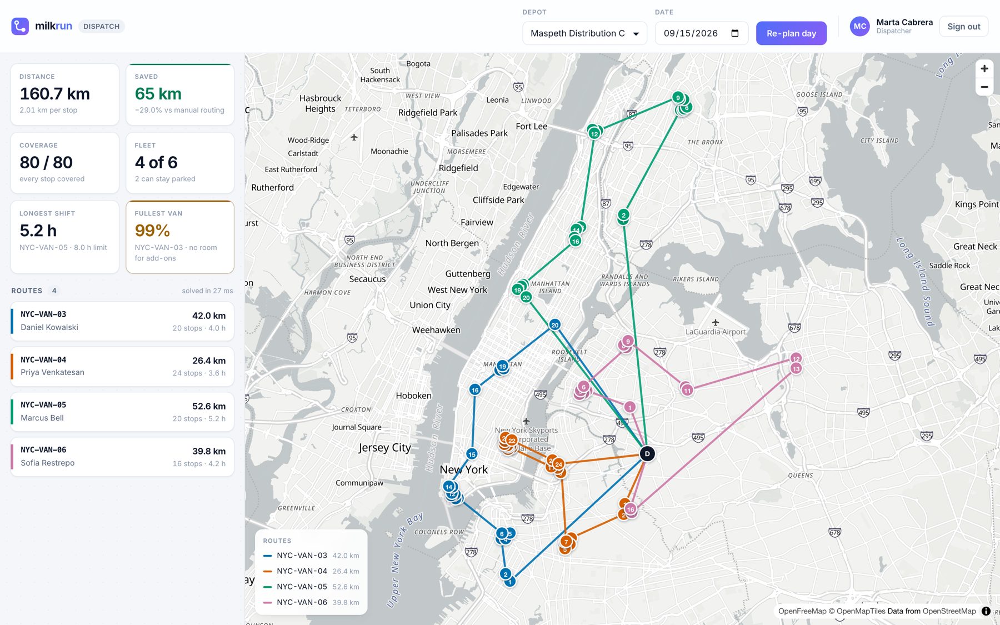

<div align="center">


# milkrun

**Route planning for delivery fleets. Plans 400 stops across 26 vans in under half a second.**

[](https://github.com/ernestgonzalezv/milkrun/actions/workflows/ci.yml)
[](LICENSE)
[](#development)
[](#development)
[](backend/optimizer)



</div>

---

A milk run is one trip that serves many stops. milkrun works out which stops go on which van,
and in what order, then follows the day as it happens.

The core is [`backend/optimizer/`](backend/optimizer), a vehicle routing solver written from
scratch in pure Python with no dependencies. It uses Clarke-Wright savings, 2-opt and Or-opt local
search, and cheapest insertion. On 400 deliveries across 26 vehicles it runs in **0.45 s** and
finds routes **16 to 22% shorter** than a dispatcher planning by hand.

Every number here comes from `make bench`, and the benchmark reports the cases where the solver
loses as well as the ones where it wins.

## Run it

You need Python 3.13, Node 24 and `make`. No API keys, no cloud account, no Docker.

```bash
git clone https://github.com/ernestgonzalezv/milkrun.git
cd milkrun
make setup && make migrate && make seed   # 80 deliveries across New York, already planned
```

Then in two terminals:

```bash
make run    # API        http://127.0.0.1:8000
make web    # dashboard  http://localhost:5173
```

Sign in as `dispatch` / `milkrun`, then press **Re-plan day** and watch the solve time.

| | |
|---|---|
| API docs | <http://127.0.0.1:8000/api/docs/> |
| Public tracking, no auth | `GET /api/v1/track/{code}/` |
| Other cities | `make seed CITY=chicago` or `la` or `havana` |

## What it is

Three clients over one API.

| Client | User | What it does |
|---|---|---|
| Dashboard (React 19, MapLibre) | dispatcher | plans the day, watches it happen |
| Driver app (Kotlin, Compose) | driver | the day's stops, works with no signal |
| Public tracking (no auth) | customer | where is my delivery |

The driver app drives most of the architecture. Deliveries get marked in basements and dead
zones, so the app writes to a local queue and syncs when the signal comes back. That queue is safe
to resend: the guarantee is a database constraint, not a check in Python. See
[ADR 0003](docs/adr/0003-idempotencia-de-la-cola-offline.md).

## The solver

Planning a day is the vehicle routing problem. Split N stops across K vehicles, respect capacity
and shift length, minimise distance. Assigning 400 stops to 26 vans has more possible answers than
there are atoms in the universe, so the exact optimum is out of reach and a heuristic is the only
option.

```
1  savings       which stops belong on the same trip     Clarke-Wright
2  consolidate   fit the routes into the real fleet
3  local search  untangle each route                     2-opt, Or-opt
4  insertion     place whatever was left over            cheapest insertion
```

### Results

Run `make bench`. Average of 5 instances per row, distances in km.

Fleet sized to the day's demand:

```
 stops  veh |  plan km  served  km/stop |   NN km  served |  vs NN   vs arrival-order    time
    25    3 |      131      25     5.22 |     163      25 |  19.4%              64.1%     2ms
    50    4 |      183      50     3.66 |     237      50 |  22.3%              72.1%     9ms
   100    8 |      282     100     2.82 |     353     100 |  20.1%              78.1%    30ms
   200   14 |      435     200     2.18 |     547     200 |  20.1%              82.6%   114ms
   400   26 |      704     400     1.76 |     842     400 |  16.3%              85.9%   453ms
```

Fleet at 80% of demand:

```
   400   26 |      746     319     2.34 |     763     328 |  -0.6%              82.2%   351ms
```

The second table matters as much as the first. Clarke-Wright minimises distance. It does not
maximise coverage. When capacity runs short the problem turns into which stops to serve at all,
and a greedy baseline catches up. A test pins this so it cannot quietly get worse.

Two things make the numbers comparable. The baselines run with the same fleet and the same
constraints. Improvement is measured per stop served, because a method that delivers less also
drives less.

### Against OR-Tools

Baselines are human rivals. To find the real cost of the heuristic it has to run against the
industry standard, so `make bench-ref` puts it next to
[Google OR-Tools](https://developers.google.com/optimization) on the same instances.

```
 stops  veh |  milkrun km/stop    time |  OR-Tools km/stop    time |    gap
    50    4 |            3.660    10ms |             3.458   5000ms |  +5.8%
   200   14 |            2.176   117ms |             2.186   5000ms |  -0.4%
   400   26 |            1.760   466ms |             1.873   5000ms |  -6.0%
```

At 400 stops milkrun comes out ahead. That needed checking rather than celebrating: the obvious
explanation is that 5 seconds is not enough for OR-Tools at that size. So it got more time and
different starting strategies.

```
400 stops, milkrun: 1.756 km/stop in 0.45 s

OR-Tools, growing budget      5s 1.858    15s 1.855    30s 1.818    60s 1.807
OR-Tools, 20s, other starts   PATH_CHEAPEST 1.851   SAVINGS 1.893   CHRISTOFIDES 1.829
```

It is not a time problem. At 60 seconds, 130 times the budget, OR-Tools is still 2.8% behind.

The headline is still not "beats OR-Tools". Four starting strategies and budgets up to a minute
ran on factory settings. OR-Tools has metaheuristics and LNS parameters that nobody touched here,
and someone who knows the library would likely close and reverse the gap. The claim that holds is
smaller and still useful: a well built construction heuristic keeps up with the reference library
while running three orders of magnitude faster.

With a saturated fleet OR-Tools wins where it counts. It serves 344 stops against 320.

### Against the exact optimum

OR-Tools is a strong reference but still a heuristic. On small instances the optimum can be
computed, so
[`test_optimizer_properties.py`](backend/tests/test_optimizer_properties.py) computes it. It walks
the entire solution space, every permutation of stops across every partition between vehicles, and
compares.

```
capacity to spare, 6 to 8 stops    gap  0.00%     the plan is the optimum
capacity tight, 7 stops            gap  2 to 12%  mean 2.3%, worst 11.8%
```

With room to spare, Clarke-Wright with 2-opt and Or-opt does not land near the optimum. It lands
on it. Once capacity forces the work across vehicles the question stops being what order and
becomes what goes with what, and that is where the heuristic costs something.

The tests assert equality rather than a bound. A 20% tolerance would not catch a 15% regression
when reality is 0%.

## Architecture

```
backend/     Django 5 + DRF. domain/ has no framework imports, apps/ is the adapter.
  optimizer/ the solver. Pure Python, no dependencies, does not import Django.
web/         React 19 + TypeScript + Vite + TanStack Query + MapLibre.
android/     Kotlin + Compose, multi-module Clean Architecture.
infra/       Terraform for AWS. See the note in Known limitations.
docs/adr/    the decisions and what they cost.
```

Three decisions shape the rest.

**Delivery state is a projection, not a field.** Events append to a log and `status` derives from
it. This is what makes the driver's offline queue safe to resend, and it answers "what did the
system know at 3pm" during a customer dispute.
[ADR 0002](docs/adr/0002-bitacora-append-only-y-estado-proyectado.md)

**Idempotency lives in a database constraint.** Not in application code, where two concurrent
syncs race. [ADR 0003](docs/adr/0003-idempotencia-de-la-cola-offline.md)

**The optimizer does not know Django exists.** It takes dataclasses and returns dataclasses, which
is why the brute-force test above can run it without a database.
[ADR 0004](docs/adr/0004-optimizador-como-paquete-puro.md)

Tests enforce the boundaries, not convention.
[`test_architecture.py`](backend/tests/test_architecture.py) fails if the domain imports a
framework, if a view with business rules touches the ORM, or if a use case wraps another.

## Known limitations

- **Distances are estimates.** Haversine with a 1.35 detour factor, not street distances. Fine for
  comparing routes, not for billing a client per kilometre. The error is worst with a barrier in
  between: two points 2 km apart in a straight line can be 12 km apart through a tunnel.
  [ADR 0006](docs/adr/0006-distancias-geodesicas-con-factor-de-rodeo.md)
- **With a saturated fleet the solver serves fewer stops than OR-Tools**, 320 against 344. Closing
  that needs inter-route local search, relocate and swap, which is not built.
- **The dashboard keeps the JWT in `localStorage`**, so an XSS steals it. An `httpOnly` cookie is
  the right answer for a browser-only client. This backend also serves a mobile app, where cookies
  do not apply.
- **Android stores tokens in DataStore unencrypted.** Production would put them behind the
  Keystore.
- **The Terraform has never been applied to a real AWS account.** CI validates it with `fmt`,
  `validate`, `tflint` and `checkov`, using no credentials. `terraform apply` is blocked on
  purpose. [`infra/README.md`](infra/README.md)

## Development

```bash
make test        # backend + dashboard tests
make coverage    # the same, with coverage and the thresholds enforced
make lint        # ruff + oxlint + tsc
make bench       # optimizer benchmark
make bench-ref   # adds the OR-Tools comparison, slow, needs requirements-dev
make android     # Android tests, detekt, spotless, lint and debug APK
make schema      # regenerate docs/openapi.yml from the code
```

379 tests pass across four surfaces.

| Surface | Tests | Coverage | Gate |
|---|---|---|---|
| Backend | 243 | **81%** statements, branch coverage on | fails under 80% |
| Dashboard | 73 | **71%** statements, 69% branches | fails under 70% |
| Android | 63 | not measured yet | |

Coverage runs in CI with the thresholds enforced, so it cannot drift down quietly. Two things
about the numbers are worth saying plainly:

- **Branch coverage is on for the backend.** It is the harder metric: 81% with branches is lower
  than the 83% the same suite reports counting statements only.
- **`MapPanel.tsx` sits at 25% and drags the dashboard average down.** It is 377 lines that need
  a real WebGL context, which jsdom does not have. The path that is tested there is the one that
  matters most, the failure card that appears when the map cannot start, because a panel that
  renders nothing looks the same as a panel with no data. The drawing path is verified in a
  browser instead.

ruff, oxlint, tsc, detekt, spotless and Android lint are clean. CI runs all four surfaces plus
Terraform validation on every push.

See [CONTRIBUTING.md](CONTRIBUTING.md) to send a change.

## License

[MIT](LICENSE) © Ernesto González
